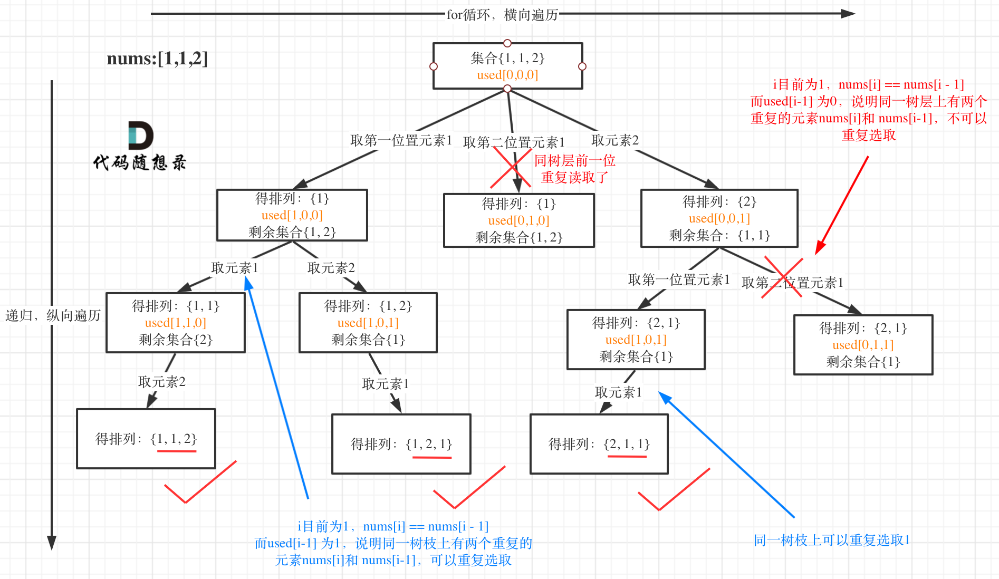

# Java面试代码仓库

包含算法面试题的求解和一些八股文的代码理解


# 一、 数组相关问题


## 1 数组问题解题思路

### 1 常见的排序算法;

快排的分区算法，归并的merge算法，桶排序算法的入桶算法

### 2 双指针

比如在有序数组中找两个数字之和为target

#### 2.1 对撞指针

#### 2.2 滑动窗口

    题目关键词 ： 连续 子数组 子串


# 二、查找相关问题

set、 map的使用

## 1. 查找相关问题

L202 happy number


L290 word pattern


L205


L451


**L1 two sum**
题目要求： 无序数组

（之前有序的话用对撞指针）

> 先查询第i个能不能和之前插入到map中元素（<元素值，下标>）组合成一个结果 ----解决数组中含两个相同的元素的问题
> 直到遍历完数组，结束

**L15 three sum**

> 注意排序配合set去重的技巧
> 排序保证了结果的有序性， 再加上去重，才能实现真正的去重

**L18 four sum**

> 和L15一样的思路

**L16 3sum closest**
注意：可能不需要查找表

> 找两个数之和最接近target的最快方法是排序后加对撞指针
> 和找等于target不同的是，只有两个数之和更接近target的时候才更新。

**L454 4sumII**

> A + B 的所有可能放入map, C + D 的所有可能去map中查找有无，有！那是几个？

**L49 Group Anagrams**

> 掌握字符串如何快速排序

```java
char[]chars=strs[i].toCharArray();
Arrays.sort(chars);
```

------

**L447 回旋镖的数量**

> 1. 求数组中两两之间的距离相等的个数 {distance :  number}
> 2. 如果是1说明距离为distance的只有1个，那么不可能找到两个
>
> 3. 如果是2说明距离为distance的有2个，那么可以找到2 * 1个（i,j,k）使得dis(i,j) = dis(i,k)
>
> 4. 如果是3说明距离为distance的有3个，那么可以找到3 * 2个（i,j,k）使得dis(i,j) = dis(i,k)
>    ....
>    考虑顺序，这是排列问题，而不是组合问题

**L149 直线上最多的点数**

```java
Double zero1=0.0D;
Double zero2=-0.0D;
System.out.println(zero1==zero2); // false
System.out.println(zero1.equals(zero2)); // false
System.out.println(zero1.equals(zero2)); // false

System.out.println(zero1.doubleValue()==zero2.doubleValue()); //true
```

统计任意两点之间的斜率，在一条直线上最多的点，说明斜率相等的个数最多。

**L219 存在重复元素II**

> 是一个滑动窗口加查找表问题
> 保持一个[l, l+k]长度的区间，在这个区间相等的元素一定满足索引之间的距离差小于等于k
> 如果没有相等元素的话，那么检查l+k+1是否在[l+1, l+k]中存在重复元素，
> 如果有，直接返回true
> 如果没有，有移区间变成[l+1,l+k+1], 直到区间的有边界超出了数组长度

**L3 无重复字符的最长子串**

> 滑动窗口 + set
> r不断右移，当出现重复的字符，不断移动l, 直至不出现重复为止

L217 存在重复元素


**L220 存在重复元素 III**
与 L219 结合起来看

> 是一个滑动窗口加查找表问题
> 保持一个[l, l+k]长度的区间，在这个区间相等的元素一定满足索引之间的距离差小于等于k
> 使用一种能快速查询的数据结构, 在这个区间找到一个数， 这个数大于v-t且小于v+t的
> TreeSet的ceiling(v-t)返回值 < v+t

**TreeSet接口的方法记忆**

> ceiling(val) ceiling天花板 -> 在上面 -> **大于**val的最小元素
> floor(val) floor地板 -> 在下面 -> **小于**val的最大元素

## 2. 查找问题解题思路

### 技巧有哪些？

1. **给二维数组去重，二维数组中不能有一样的数组的方法？**

> 1. 先排序保证了结果的有序性
>
> 2. 再Set加上去重，才能实现真正的去重

2. **找两个数之和最接近target的方式**

> 找两个数之和最接近target的最快方法是排序后加对撞指针
> 和找等于target不同的是，只有两个数之和更接近target的时候才更新。

3. **掌握字符串如何快速排序**

```java
char[] chs = str.toCharArray();
Arrays.sort(chs);
String sortedStr = new String(chs);
```

4. **组合数和排列数的求解公式**

> 排列数: $n! / (n-m)!$
> 组合数: $n! / (m! * (n-m)!)$

**5. 查找问题也会和滑动窗口结合**


6. **TreeSet接口的方法记忆**

> ceiling(val) ceiling天花板 -> 在上面 -> **大于**val的最小元素
> floor(val) floor地板 -> 在下面 -> **小于**val的最大元素

# 三、链表问题

链表考察的问题，一般都不能修改链表的值，而是操作链表的节点

## 1. 链表相关问题

### 1.1 常规问题

**L206 反转链表**

> pre cur next 三个指针
>
> 1. cur.next = pre //反转
> 2. pre = cur
> 3. cur = next

L83 在链表中移除重复元素

> pre.next = cur.next;
> cur = cur.next;

**L86 列表元素分区**

> 链表的考点， 哨兵节点+虚拟节点+链表指针的移动

L328 奇偶链表

> 和上一题一模一样的思路甚至是代码

L2 链表数字相加

> 注意进位

L445 链表数字相加II

> 不能修改链表结构， 使用辅助的数据结构

### 1.2 设立链表的虚拟头结点

虚拟头结点的设置方式

```java
ListNode dummyHead=new ListNode();
dummyHead.next=head;
```

最后为了方便快速释放内存

```java
ListNode retNode=dummyHead.next;
dummyHead=null;
return retNode;
```

L203 在链表中删除val的节点


L82 在链表中删除重复的节点


**L21 合并两个有序链表**

### 1.3 复杂的穿针引线

多设置一点 节点变量

**L24 两两交换链表中的节点**

> 设置虚拟节点, 四个指针

L25

L147 对链表进行插入排序

L148

### 1.4 不仅仅是穿针引线

有时候只能靠修改值才能完成任务

L237

### 1.5 链表与双指针

**L19 删除链表的倒数第 N 个结点**

> 两个指针，一个指针多走n步

L61


L143

>   如何快速获得链表的中间元素


L234

> 如何快速获得链表的中间元素

### 1.6 快慢指针

**L141 环形链表**

> 一个slow指针走1步， 一个fast指针走2两步
> slow == fast说明有环，
> slow或者fast能走到null, 说明无环
> 另外，环的位置

## 2 链表问题解题思路

### 2.1 经典问题

虚拟头节点迭代，尤其删除节点的时候
反转单链表
删除单链表的倒数第N个节点
判断是否是环形链表，并返回入口节点

> 1. 可以用hashSet保存节点，遇到相同的节点就以及说明有环而且，这个节点就是环的入口
> 2. 再额外使用一个指针 ptr。起始，它指向链表头部；随后，它和 **slow**
>    每次向后移动一个位置。最终，它们会在入环点相遇。

### 2.2 技巧

虚拟头

双指针

快慢指针


# 四、Stack&Qeueu问题

## 1 栈问题

L20 合法的括号


L150 逆波兰表达式

逆波兰表达式是一种后缀表达式，所谓后缀就是指算符写在后面。

平常使用的算式则是一种中缀表达式，如 ( 1 + 2 ) * ( 3 + 4 ) 。

该算式的逆波兰表达式写法为 ( ( 1 2 + ) ( 3 4 + ) * ) 。

逆波兰表达式主要有以下两个优点：

去掉括号后表达式无歧义，上式即便写成 1 2 + 3 4 + * 也可以依据次序计算出正确结果。

> 注意val1 val2的位置


L71 unix路径简化


**L144 二叉树的前序遍历的非递归写法**

```java
class Command {
    String order; // print or go
    TreeNode node; // current node
}
```


L145 二叉树的后序遍历的非递归写法

easy

L94 二叉树的中序遍历的非递归写法

easy

L341

## 2 queue问题

**L102 树的层序遍历**

```java
class Node {
    TreeNode treeNode;
    int level;
}
```

L107

Collections.reverse(res);


L103
取奇数的 再 Collections.reverse(res);


L199 二叉树的左视图

层序遍历， 取最后一个元素

图的BFS


**L279 完美平方数**

> 构建图， 5的下一个状态是4（减去1的平方）或者1（减去2的平方）
> 那么5到4的最短距离就是1， 到1的最短距离就是1
> 4的下一个状态是3（减去1的平方）或者0（减去2的平方）
> 那么5到3的最短距离就是2（5->4->3）， 到0的最短距离就是2（5->4->0）


**L127 单词接龙**

需要建图，依据朴素的思路，我们可以枚举每一对单词的组合，判断它们是否恰好相差一个字符，以判断这两个单词对应的节点是否能够相连。但是这样

效率太低，我们可以优化建图。

具体地，我们可以创建虚拟节点。对于单词 hit，我们创建三个虚拟节点 it、ht、hi，并让 hit 向这三个虚拟节点分别连一条边即可。如果一个单词能够转化为hit，那么该单词必然会连接到这三个虚拟节点之一。对于每一个单词，我们枚举它连接到的虚拟节点，把该单词对应的 id 与这些虚拟节点对应的id 相连即可。

最后我们将起点加入队列开始广度优先搜索，当搜索到终点时，我们就找到了最短路径的长度。注意因为添加了虚拟节点，所以我们得到的距离为实际最短路径长度的两倍。同时我们并未计算起点对答案的贡献，所以我们应当返回距离的一半再加一的结果。


**L126 单词接龙 II**

记录最短路径——经典

> Map<下一个节点，当前节点> 方便快速找到下一个节点是从哪个节点来的

## 3 优先队列

用一个数组实现堆

调研PriorityQueue的API, 随机插入10个数字，并取出，看是最大堆还是最小堆

> 小顶堆， 小的在上面就是小顶堆
> [1, 3, 6, 5, 4, 2] -> [1,2,3,4,5,6]

利用Comparator实现最大堆 **compare函数中两个参数位置的记忆方法**：

> o1 - o2 1,2 所以是升序
> o2 - o1 2,1 所以是降序

```java
new Comparator<Integer>(){
@Override
public int compare(Integer o1,Integer o2){
        return o2-o1;
        }
        }
```

> 大顶堆， 大的在上面就是大顶堆
> [1, 3, 6, 5, 4, 2] -> [6,5,4,3,2,1]

使用`PriorityQueue`实现数字按个位数排序

```java
public static void main(String[]args){
    PriorityQueue<Integer> queue=new PriorityQueue<>(new Comparator<Integer>(){
        @Override
        public int compare(Integer o1,Integer o2){
            return o1%10-o2%10;
        }
    });
    int[] nums = new int[]{51,93,66,85,14,12};
    for(int i=0;i<nums.length;i++){
        queue.add(nums[i]);
    }
    while(!queue.isEmpty()){
        Integer poll=queue.poll();
        System.out.print(poll+",");
    }
}
```

输出：
```51,12,93,14,85,66```


**L347 前 K 个高频元素**

PriorityQueue传入的是比较器Comparator, 如果不想传，那么添加元素的类型必须是可比较的，如果是自定义的类， 必须实现Comparable接口


**L23 合并 K 个升序链表**


# 五、二叉树和递归

## 1 二叉树的相关问题

### 1.1 常规问题

L104 二叉树的最大深度


L111 二叉树的最小深度

**注意递归的终止条件**

```java
题目求解的答案必须到叶子节点的话
if(root.left==null&&root.right==null)
   return xxxx; // 递归的终止条件之一

因为使用了root.xxxx 所以root不能为null
那么之前还需要加上另外一个终止条件
if(root==null)
   return xxxx;
```

> 可以把一些特俗情况先判断了，然后编写一个XXXCore函数，在XXXCore递归函数中完成一般情况


L226 翻转二叉树


L100 相同的树


L101 对称二叉树


L222 完全二叉树的节点个数

> 可以写一个求任何一颗二叉树的节点


**L110 判断平衡二叉树**

> 设置私有变量
> private boolean res;


**L112 路径总和**

注意递归的终止条件

1. 如果强调了必须终止在叶子节点，那么应该判断

```java
if(node.left==null&&node.right==null)
    return;
```

2. 如果没有强调叶子节点，那么终止条件应该判断

```java
if(node==null)
    return;
```


### 1.2 稍复杂的递归逻辑

**L257 二叉树的所有路径**

> 递归问题中， 如果有返回值
> 思考问题的方式是：拿到左子树的返回值怎么做？拿到右子树的返回值又该怎么做？


**L113 路径总和 II**

递归中保留结果的方式

比如： 函数需要返回List<List\<Integer>>

> 设置外部私有变量，

```java
private List<List<Integer>> res = new ArrayList();
```

并且在辅助方法上加上一个`List<Integer>`类型的参数，保留递归时候的结果
在退出条件的时候，如果找到了一个满足题意得答案，就添加到res中，这类问题，还需要回溯.
一个模板代码

```java
public class C03TreePathsSumII {
    private List<List<Integer>> res = new ArrayList<>();

    public List<List<Integer>> pathSum(TreeNode root, int targetSum) {
        if (root == null)
            return res;
        List<Integer> list = new ArrayList<>();
        pathSumCore(root, targetSum, list);
        return res;
    }

    private void pathSumCore(TreeNode root, int targetSum, List<Integer> list) {
        if(root == null)
            return;
        if(root.left == null && root.right == null){
            if(root.val == targetSum){
                list.add(root.val);
                res.add(new ArrayList<>(list));
                list.remove(list.size() - 1);
            }
            return;
        }
        list.add(root.val);
        pathSumCore(root.left, targetSum - root.val, list);
        pathSumCore(root.right, targetSum - root.val, list);
        list.remove(list.size() - 1);
    }
}
```


L129 求根节点到叶节点数字之和

> 套用上面得模板即可


### 1.3 更复杂的递归逻辑

L437 [路径总和 III](https://leetcode.cn/problems/path-sum-iii/)


### 1.4 二分搜索树相关问题

L235 二叉搜索树的最近公共祖先


L98 验证二叉搜索树


**L450 删除二叉搜索树中的节点**

> 分类讨论
> 如果目标节点大于当前节点值，则去右子树中删除；
> 如果目标节点小于当前节点值，则去左子树中删除；
> 如果目标节点就是当前节点，分为以下三种情况：
> 其无左子：其右子顶替其位置，删除了该节点；
> 其无右子：其左子顶替其位置，删除了该节点；
> 其左右子节点都有：其左子树转移到其右子树的最左节点的左子树上，然后右子树顶替其位置，由此删除了该节点。


**L108 将有序数组转换为二叉搜索树**

> 二分搜索的逆过程


L230

partition


L236

## 2. 树的问题解题思路

1. **题目强调必须到叶子节点才符合题意。**

   因为，叶子节点已经判断了，所以不会出现root的两边都是空的情况，
   那出现root == null的情况是root只有一个孩子节点，下次递归的时候就会走到root==null
   那么，应该思考这种情况的退出条件是什么。

```java
if(root==null)
    return xxxx; // 因为使用了root.left/right 所以root不能为null 
if(root.left==null && root.right==null)
    return xxxx; // 递归的终止条件之一
```

2. **需要重新写一个递归函数的题目**

> 可以把一些特俗情况先判断了，然后编写一个XXXCore函数，在XXXCore递归函数中完成一般情况

3. **递归问题中， 如果有返回值**

> 思考问题的方式是：拿到左子树的返回值怎么做？拿到右子树的返回值又该怎么做？

4. **保留递归中结果的方式**
   比如： 函数需要返回List\<List\<Integer>>

> 1. 设置外部私有变量

```java
private List<List<Integer>>res=new ArrayList();
```

用于 保存所有递归终止位置的结果， 也就是所有符合题意得结果。

> 2. 并且在辅助方法上加上一个List\<Integer>类型的参数，保留递归时候的结果

在退出条件的时候，如果找到了一个满足题意得答案，就添加到res中，
这类问题，还需要回溯. 一个模板代码。

```java
public class C03TreePathsSumII {
    private List<List<Integer>> res = new ArrayList<>();

    public List<List<Integer>> pathSum(TreeNode root, int targetSum) {
        if (root == null)
            return res;
        List<Integer> list = new ArrayList<>();
        pathSumCore(root, targetSum, list);
        return res;
    }

    private void pathSumCore(TreeNode root, int targetSum, List<Integer> list) {
        if(root == null)
            return;
        if(root.left == null && root.right == null){
            if(root.val == targetSum){
                list.add(root.val);
                res.add(new ArrayList<>(list));
                list.remove(list.size() - 1);
            }
            return;
        }
        list.add(root.val);
        pathSumCore(root.left, targetSum - root.val, list);
        pathSumCore(root.right, targetSum - root.val, list);
        list.remove(list.size() - 1);
    }
}
```

5. **dfs**
   
   比如： 求二叉树的左孩子之和。
   
   


6. **bfs**
   
   比如： 求二叉树的右视图

   其实就是二叉树的层序遍历，取每一层的最后一个元素即可。
   
   
   
7. **二叉树的前序的倒序遍历**

   前序遍历：先root再left在right

   前序的倒序遍历: 先right再left在root

# 六、递归和回溯法

## 1 递归回溯相关问题

### 1.1 树形问题

**L17 电话号码的字母组合**

树形问题递归就是从节点发散出去多条线
一般就是在循环中递归， 循环的对象就是发散出去的元素组成的列表。
如果需要知道到每个结点的结果——在递归上加一个参数。
这个参数是非引用类型的，不需要回溯
这个参数是引用类型的，会影响其他节点上的结果， 因此，需要回溯

> 字符串在本次递归不想被修改，应该在递归函数中 s + letters[i]
> 如果在递归函数外部加上s += letters[i]， 再传入递归函数中, 此时还需要回溯。


**L93 ip地址**

怎么实现剪枝

递归前加上if, 只有满足条件的才往下面走

```java
if(check()){
    recursion().....
}
```


L131 分割回文串

上面的模板

### 1.2 树形问题————排列问题

**L46 全排列**

全排列是很多问题的暴力解法
本质也是一种树形问题————套用树形问题的模板

> 1. 设置类的私有属性res， 类型就是返回值的类型
> 2. 编写辅助递归函数，确定函数的参数，（一般需要加上res的元素的所属类型,如下例子）

```java
private List<List<String>>res;
XXXCore(xx xx,List<String> list);
```

> 3. 树形问题递归就是从节点发散出去多条线， 一般就是在循环中递归， 循环的对象就是发散出去的元素组成的列表。
> 4. 这个参数是非引用类型的，不需要回溯。
>    这个参数是引用类型的，会影响其他节点上的结果， 因此，需要回溯

*注意*： 

字符串在本次递归不想被修改，应该在递归函数中 s + letters[i] 如果在递归函数外部加上s += letters[i]，再把s传入递归函数中, 此时还需要回溯。


**L47 含重复元素的全排列 (非常重要)**

一种，二维数组去重，就是列表转字符串

**另一种，更好的方法是剪枝**


**要点：**

1. 先排序： 排序能够保证相同的元素的一定是相邻的。
2. 当`nums[i] = num[i-1]` 说明选到了相同的元素
3. 如果: `used[i-1]=false` 说明在这一树层重复（这种是不被允许的）
4. 如果: `used[i-1]=true` 说明在树枝上重复（这种是可允许的）

核心代码

```java
Arrays.sort(nums);
....
    
if(i>0&&nums[i]==nums[i-1]&&!used[i-1])
    continue;
```

全部代码

```java
private List<List<Integer>>res;

public List<List<Integer>>permuteUnique(int[]nums){
    Arrays.sort(nums);
    res=new ArrayList<>();
    boolean[]used=new boolean[nums.length];
    if(nums.length==0)return res;
    List<Integer> list=new ArrayList<>();
    permuteUniqueCore(nums,list,used);
    return res;
}

private void permuteUniqueCore(int[]nums,List<Integer> list,boolean[]used){
    if(list.size()==nums.length){
        res.add(new ArrayList<>(list));
        return;
    }
    for(int i=0;i<nums.length;i++){
        if(i>0&&nums[i]==nums[i-1]&&!used[i-1])
            continue;
        if(!used[i]){
            used[i]=true;
            list.add(nums[i]);
            permuteUniqueCore(nums,list,used);
            list.remove(list.size()-1);
            used[i]=false;
        }
    }
}
```

### 1.3 树形问题————组合问题

**L77 组合**

本质也是一种树形问题————套用树形问题的模板


L39 组合总和

可以重复选， 但是没有重复的元素


**L40 组合总和II**

元素只能选1次，但是包含重复元素。

因此，需要去重。

1 如果采用的是选和不选问题（二叉树形递归）的思考方式

> 那么去重的手段就是：**如果选择不要当前数字时，直接跳过所有与之重复的数字，去下一个不同的数字位置上继续尝试**


2 如果采用的循环递归（多叉树形递归）的思考方式

> **那么就是之前的剪枝手段，先排序，再判断是数层相同还是树枝相同。数层相同是会造成结果重复的，应该剪枝。**


L216 组合总和 III


### 1.4 树形问题————子集问题

L78 子集


L90 子集去重问题

如果采用的循环递归（多叉树形递归）的思考方式

**那么就是之前的剪枝手段，先排序，再判断是数层相同还是树枝相同。数层相同是会造成结果重复的，应该剪枝。**


**L401 二进制手表**


### 1.5 二维平面上使用回溯法

**L79 寻找单词**

四个方向搜索技巧：

```java
private int[][]d=new int[][]{{0,1},{0,-1},{-1,0},{1,0}};
```

八个方向搜索技巧

```java
for(int i=-1;i<=1;i++){
    for(int j=-1;j<=1;j++){
        if(i==0&&j==0){
            continue;
        }
        System.out.println(i+","+j);
    }
}
```

### 1.6 二维平面上使用回溯法——floodfill算法

L200 [岛屿数量](https://leetcode.cn/problems/number-of-islands/)


L130 [被围绕的区域](https://leetcode.cn/problems/surrounded-regions/)

从四条边开始深度优先搜索， 最后遍历一遍没有被visited的'O'，并把他们标记为'X'


L417 [太平洋大西洋水流问题](https://leetcode.cn/problems/pacific-atlantic-water-flow/)


### 1.7 二维平面搜索问题

L51 n皇后问题


L52 n皇后问题II


**L37 数独问题**


# 七、动态规划


**想清楚一个问题的递归结构以后，发现又重叠子问题。就可以使用记忆化搜索或者动态规划来解决。**

可以用动态规划来解决的递归结构的鲜明特点就是**具备重叠子问题**， 可以发现在递归章节中是只有递归结构，但不具有重叠子问题。

因此，先和以前一样，递归的（**从上往下**）思考问题的解法，

如果这个问题有重叠子问题，先使用记忆化搜索解决，

然后再动态规划（**从下往上**）解决。

## 1 动态规划相关问题

**L70 走楼梯**

```text
起始/终止条件： memo[1] = 1; memo[2] = 2;

递归： memo[n] = memo[n-1] + memo[n - 2];

递推: i >= 3;  memo[i] = memo[i-1] + memo[i - 2];
```


**L120 三角形最小路径和**

```text
起始/终止条件： memo[m - 1][i] = triangle.get(m - 1).get(i);

递归： triangle.get(i).get(j) + Math.min(f(triangle, i + 1, j), f(triangle, i + 1, j + 1));

递推: memo[i] = triangle.get(i).get(j) + Math.min(memo[i + 1][j], memo[i + 1][j + 1]);
```


**L64 [最小路径和](https://leetcode.cn/problems/minimum-path-sum/)**

思考非负整数， 和限定只能每一步只能左移或者下移的条件和动态规划的关系

```text
起始/终止条件：
if (i == m - 1 && j == n - 1)
      return grid[i][j];
if (i >= m || j >= n)
    return Integer.MAX_VALUE;
           

递归： grid[i][j] + Math.min(f(grid, i + 1, j), f(grid, i, j + 1));

递推:  grid[i][j] + Math.min(memo[i + 1][j], memo[i][j + 1]);

这是递推的核心，当然和递归一样，有一些边界需要考虑
```


**L343 [整数拆分](https://leetcode.cn/problems/integer-break/)**

**递归外边一层循环，动态规划就要在memo的维度上也多一层循环**

```text
// 起始/终止条件：
if (n == 1)
      return 1;


// 循环递归： 
for (int i = 1; i <= n - 1; i++) {
    res = max3(res, i* (n - i), i * integerBreak(n - i));
}
这里的n在递归的时候是在**变化**的

// 递推: 
n 变成了 i
for (int j = 1; j <= i - 1; j++) {
    memo[i] = max3(memo[i], j * (i - j), j * memo[i - j]);
}
```


**L279 完全平方数**

```text
// 起始/终止条件：
if (n == 1)
    return 1;
if (n == 0)
    return 0;

// 循环递归： 
func : numSquaresCore(int n){ 
    int res = Integer.MAX_VALUE;
    for (int i = 1; n - i * i >= 0; i++) {
        res = Math.min(res, 1 + numSquaresCore(n - i * i));
    }
}
这里函数的n在递归的时候是在**变化**的

// 递推: 
n 变成了 i
for (int j = 1; i - j * j >= 0; j++) {
    memo[i] = Math.min(memo[i], 1 + memo[i - j * j]);
}
```

## 2 递归转动态规划总结

从L279 和 L343这两道题就可以总结出递推转递归的规律了。

> 1. 最外层是memo的遍历，因为memo中每个位置都要推导并填上正确的值。
>
> 2. **递归外边一层循环（循环递归），动态规划就要在memo的维度上也多一层循环**
>
> 3. 赋值递归逻辑，
>    - 函数 -> memo
>    - 函数参数 -> 外层循环的值
>    - 当前值res -> memo[i] // 一维就是memo[i], 二维就是memo\[i][j]


L91 解码方法


L62 不同路径


L63 不同路径II


L198 打家劫舍


**L213 打家劫舍 II**

> 这个地方所有的房屋都围成一圈 ，这意味着第一个房屋和最后一个房屋是紧挨着的。
>
> 一个关键思想在于，环可以拆分成两种情况，分别取nums数组为0 ~ nums.size()-2或者nums为1 ~ num.size()-1，
>
> 比较两者最大结果即可。其余和之前写过的 打家劫舍I C++ beats 100% 是一样的。


L337  打家劫舍 III


L309 最佳买卖股票时机含冷冻期


## 3 背包问题

#### 3.1 01 背包

**递归**：

考虑将n个物品放进背包的最大价值，直到考虑将1个物品放入背包的最大价值，递归终止。

对于当前的物品，考虑选不选， 然后依次往前，直到到第一个物品。

**递推**

考虑将1个物品放进背包的最大价值，一次推到出考虑将n个物品放入背包的最大价值。

```java
memo[i][j] = memo[i-1][j];
if(j > ws[i])
    memo[i][j] = Math.max(memo[i][j], memo[i-1][j-ws[i]]);
```

#### **3.2 多重背包问题**

一个要点

> 多了一层循环： 遍历可选多少（k）个当前物品。 1 ... k

```java
for (int i = 1; i < n; i++) {
    for (int j = 1; j <= C; j++) {
        // 遍历可选多少个当前物品。
        for (int k = 0; k <= Math.min(cs[i], j / ws[i]); k++) {
            memo[i][j] = Math.max(memo[i][j], k * vs[i] + memo[i - 1][j - k * ws[i]]);
        }
    }
}
return memo[n - 1][C];
```


#### **3.3 完全背包问题**

两个要点

> 1. 第二层for循环和01背包问题不一样， 是要升序遍历的。
> 2. dp的时候不要去上一层找答案， 直接在本层找答案。


#### **3.4 多维费用背包问题**

状态转移多了一个参数而已，三维数组

比如： L474 一和零


L416 分割等和子集


**L322 零钱兑换**

> 可以使用
> BFS + visited (和**完美平方数**那道题一样的思路)
>
> DFS + 记忆化搜索
>
> 动态规划
>
> ​	-1不要着急填


**L377 组合总和 Ⅳ**


**L474 一和零**


**L139 单词拆分**


**L494. 目标和**


## 4 最长上升子序列问题

**一个概念 **

子序列问题不会要求在数组中是连续的

子数组问题会要求在数组中是连续的。


**L300 最长上升子序列**

考虑以 nums[i] 为结尾的最长上升子序列的长度。


**L376 摆动序列**


### 5 最长公共子序列问题

LCS(m,n) 表示 S1[0...m] 和 S2[0...n] 的最长公共子序列的长度


# 贪心算法

L455


L392


L435~~


